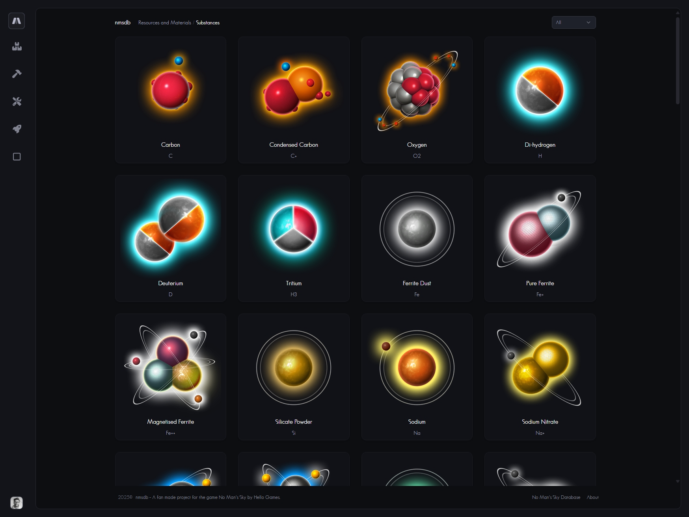
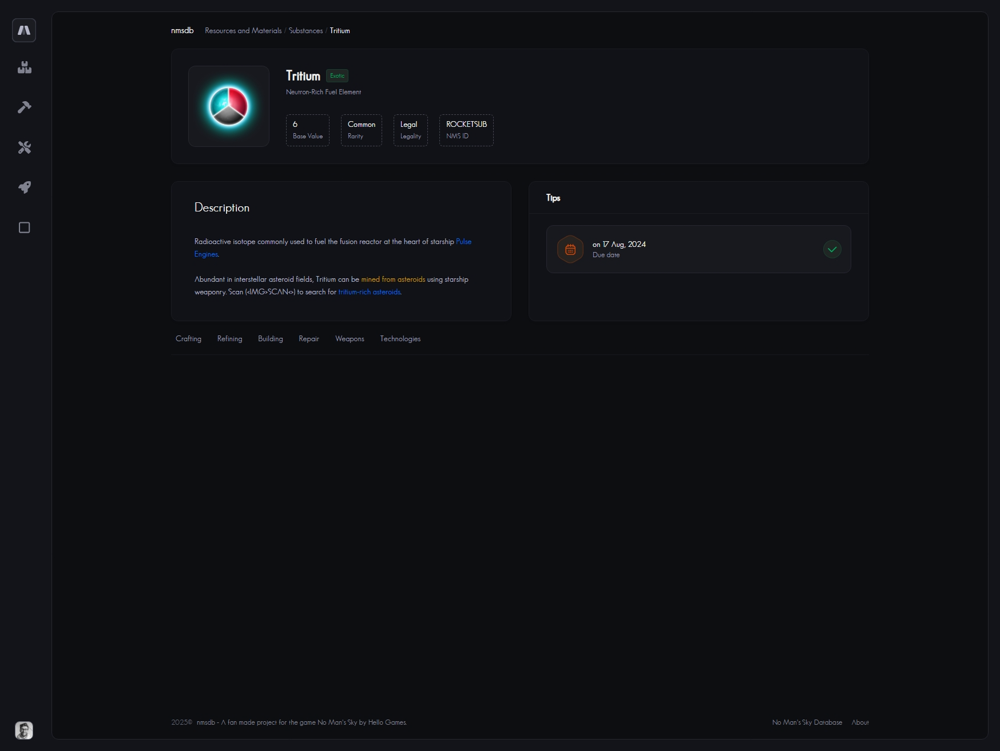
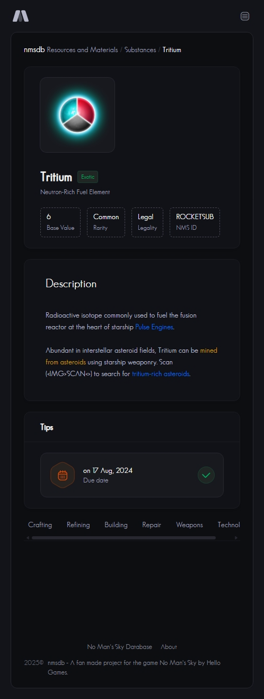

# nmsdb
No Man's Sky Database

Server side rendered with API (limiter), if you are looking to perform more requests on the API side, then you are free to host this app yourself locally.

## Building

Firstly you must run through the nmsdb-metadata repo and exported all the XMLs/files and ran through the scripts to preseed the database and redis.

